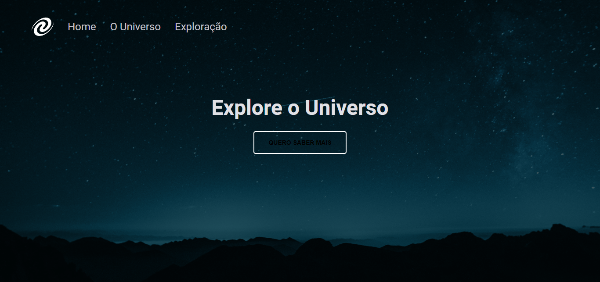

# explorer-desafio-stage06
 SPA Universe, projeto para aprimorar o conceitos de SPA, mapeamento de rotas, assíncronimos, orintação a objeto, class e outros mais...

  

## 🖥️ Projeto
Projeto SPA universe do Stage 06 da Rocketseat. Projeto incrível para aprimoração dos conceitos de SPA, promisses, assícronimos, orientação a objeto e outros conceitos muito interessantes e importantes do Javascript

## 🚀 Tecnologias
Foi desenvolvido esse projeto com as seguintes tecnologias:

- HTML
- CSS
- JAVASCRIPT
- FIGMA
- GIT
- GITHUB

## 👀 Ver
Aqui você pode visualizar o layout do projeto:
<a href="https://www.figma.com/file/jkt6vHa0yZgsSI2L14nJQ3/%5BDesafios-Explorer%5D-SPA-Universe-(Copy)?node-id=104%3A48&mode=dev">clique aqui</a>
